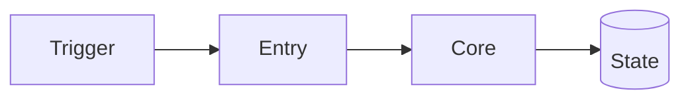
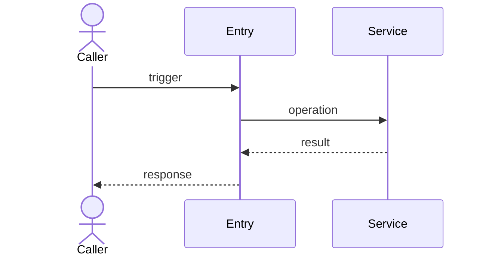

# Codebase guide: <repository>

> Scope: <modules/directories analyzed>  
> Revision: <commit or working-tree state>  
> Generated: <date>  
> Confidence: <confirmed areas and known gaps>

## Executive summary

<What the system does, who/what invokes it, and its most important architectural choices.>

## Run, test, and entry points

| Concern | Command or symbol | Evidence |
|---|---|---|
| Run | | |
| Test | | |
| Primary entry | | |

## System architecture

| Component | Responsibility | Depends on | Evidence |
|---|---|---|---|
| | | | |

## Main capabilities

| Capability | Trigger/API | Outcome | Main implementation |
|---|---|---|---|
| | | | |

## Critical flow: <name>

**Entry condition:** <condition>  
**Outcome:** <observable result>  
**Important failures:** <behavior>

| Step | Symbol/operation | Evidence | Confidence |
|---|---|---|---|
| 1 | | | Confirmed |

## Business and data flows

<Add focused flowcharts for validation, branching, persistence, events, and explicit state transitions.>

## Concurrency and lifecycle

<Goroutine ownership, channels, locks, context cancellation, startup, readiness, and shutdown.>

## Configuration and integrations

| Dependency/configuration | Purpose | Failure behavior | Evidence |
|---|---|---|---|
| | | | |

## Testing and extension points

<Test strategy, important fakes, seams, plugins, interfaces, and safe places to add behavior.>

## Risks and unknowns

| Finding | Impact | Confidence / verification |
|---|---|---|
| | | |

## Suggested reading order

1. <file/symbol and why>
