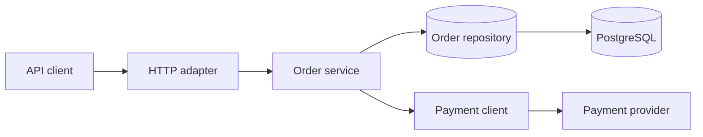
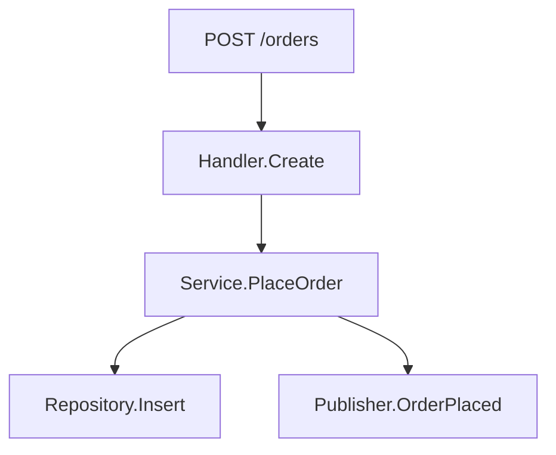
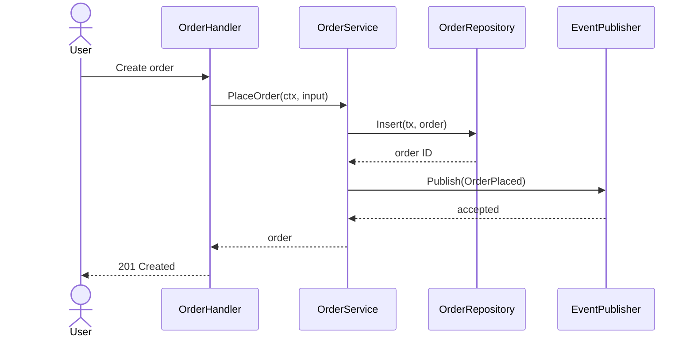
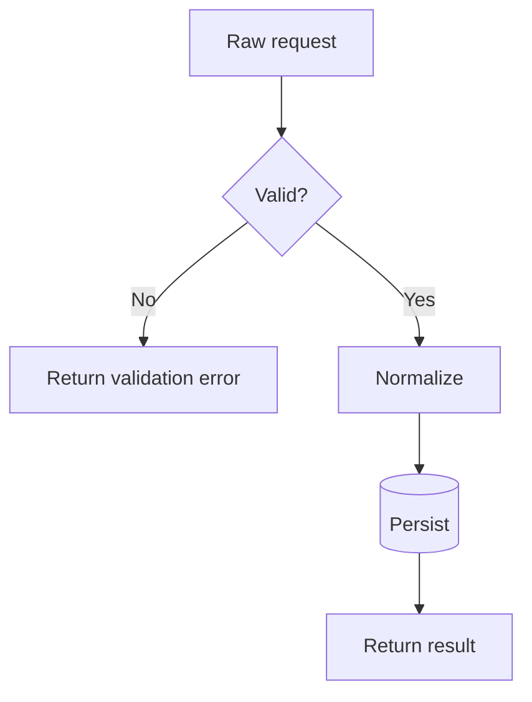
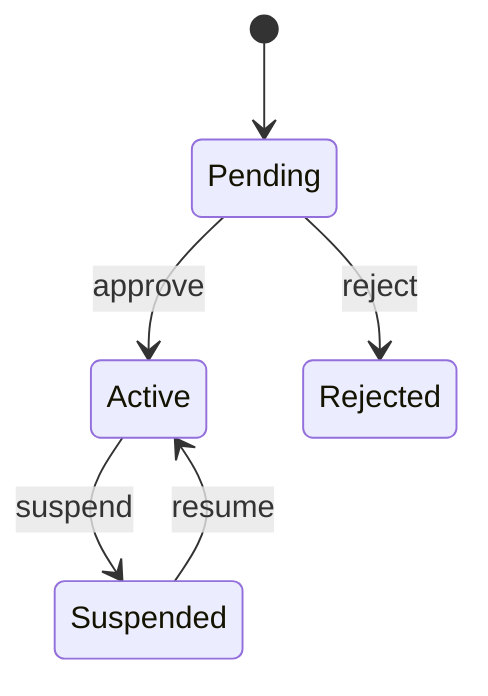

# Mermaid diagram guide

## Contents

- General rules
- Architecture flowchart
- Bounded call graph
- Runtime sequence
- Decision and data flow
- State lifecycle
- Accuracy checklist

## General rules

- Choose one question per diagram and state it in the title.
- Prefer 5–12 nodes. Split a diagram once labels or crossing edges make it hard to scan.
- Use repository terminology and concrete symbols, not invented layer names.
- Shorten labels while keeping exact symbol names in the surrounding evidence table.
- Show external systems as boundaries, not as unexplored internal steps.
- Do not put source paths inside nodes; cite them below the diagram.
- Use Mermaid syntax supported by common Markdown renderers. Avoid experimental features.

## Architecture flowchart

Use for components and dependency direction:

Do not label this a runtime call chain unless every arrow is actually invoked in that order.

## Bounded call graph

Use concrete functions for a single request or job:

Represent conditional calls with a decision node. Use `-.->` for an inferred or runtime-selected target and explain it immediately below the diagram.

## Runtime sequence

Use when timing, ordering, transactions, or async work matters:

Use `alt`, `opt`, `loop`, and `par` only when source behavior proves those branches. Show asynchronous enqueue and later consumption as separate messages; do not imply the producer waits if it does not.

## Decision and data flow

Use for validation, retries, fallback, and transformations:

Label branches with actual conditions or error classes. Do not merge distinct failure modes merely to simplify the picture if they have different user or operational consequences.

## State lifecycle

Use only for explicit domain states:

Confirm transitions in code and persistence constraints. Mention impossible or guarded transitions in prose.

## Accuracy checklist

- Does every arrow have a source call, registration, message operation, or state update?
- Is sync versus async behavior represented correctly?
- Are transaction and process boundaries visible where important?
- Are retries, loops, fan-out, cancellation, and error branches truthful?
- Are optional, build-specific, or dynamically selected edges marked?
- Can a reader find evidence for every diagram in the adjacent table?
